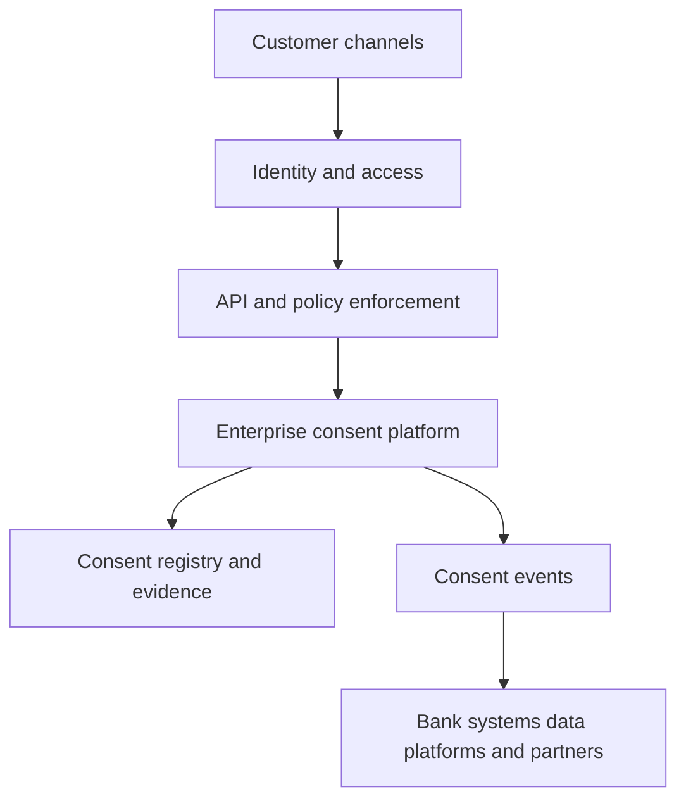

# From Consent Capture to Enforceable Compliance

## A practical point of view for Indian banks

Indian banks already capture consent in many places: account opening, loan journeys, card services, marketing preferences, partner data sharing and Account Aggregator interactions. The problem is usually not the absence of consent. It is fragmentation.

Consent may be embedded in a mobile screen, stored as a flag in a product system, retained in a document repository, or known only to a third-party service provider. When a customer withdraws consent, the bank may struggle to determine which applications, analytics pipelines, partners and campaigns must stop processing the data. When an auditor asks what the customer agreed to, the bank may be able to show an acceptance timestamp but not the exact notice, purpose, data categories, recipient or validity period.

The Digital Personal Data Protection Act 2023 and the Digital Personal Data Protection Rules 2025 make this an enterprise architecture issue. RBI requirements for digital lending and Account Aggregators add banking-specific obligations. A bank therefore needs more than a consent screen: it needs a governed chain from notice and capture to decision, enforcement, propagation and evidence.

> The objective is not to centralise every customer interaction. It is to establish a reliable, enterprise-wide consent state that every channel and processing system can consume and enforce.

## What the regulatory direction means in practice

Under the DPDP Act, consent used as the basis for processing must be free, specific, informed, unconditional and unambiguous, expressed through clear affirmative action, and limited to data necessary for the specified purpose. The Data Principal can withdraw consent with comparable ease, and the Data Fiduciary must be able to prove that notice and valid consent were obtained.

The final DPDP Rules were notified on 13 November 2025 with phased commencement. The notice rule requires a standalone, clear account of the personal data and specified purposes, together with a way to withdraw consent, exercise rights and complain. Organisations should plan against the applicable commencement dates rather than assume that every provision began on notification day.

For banks, RBI requirements sharpen the use case. Digital-lending controls require need-based collection supported by prior, explicit consent and an audit trail, along with customer controls over particular data, third-party disclosure, revocation and deletion where applicable. The Account Aggregator framework uses a structured, revocable consent artefact and requires validation before financial information is shared.

This does **not** mean that every processing activity depends on consent. The DPDP Act also recognises certain legitimate uses, and banking laws may require processing or retention. A credible solution therefore records the processing basis and purpose; it does not reduce compliance to a single `consent = true` flag.

## The capability gap

Most banks have four gaps:

1. **Fragmented evidence.** There is no consistent record of who agreed to what, for which purpose, through which channel and under which notice version.
2. **Disconnected enforcement.** Authentication and API access controls prove identity and technical entitlement, but do not necessarily establish that a particular use of personal data is permitted.
3. **Slow withdrawal propagation.** A change in one database does not automatically stop processing in CRM, marketing, analytics, AI platforms or partner systems.
4. **Limited observability.** Privacy, risk and audit teams cannot readily trace a consent decision from customer action to downstream enforcement.

## The target operating model

An enterprise consent capability should cover eight functions:

| Capability | Practical outcome |
| --- | --- |
| Notice and purpose catalogue | Approved notices, purposes, data categories, recipients, validity and versions are governed centrally |
| Omnichannel capture | Mobile, web, branch, call centre and partner journeys capture consistent consent evidence |
| Consent registry | The bank maintains a trusted state of granted, denied, withdrawn and expired consent |
| Decision service | Applications can ask whether a specific data use is permitted at runtime |
| Enforcement | APIs and services allow or deny operations based on identity, authorization, consent and other policy conditions |
| Withdrawal propagation | Events notify applications, processors and partners that consent-dependent processing must stop |
| Rights and grievance support | Customers can review choices, withdraw, request correction or erasure where applicable, and raise grievances |
| Audit and evidence | The bank can reconstruct the notice, action, time, channel, policy and downstream response |

A useful consent record contains the subject, purpose, data categories, intended recipient or processor, processing action, legal basis, notice and policy versions, capture channel, status, grant time, expiry, withdrawal time and evidence reference.

## Separate four decisions

The architecture should keep four concepts distinct:

- **Identity:** Who is the customer or calling application?
- **Authorization:** What is that identity technically entitled to do?
- **Consent:** Has the customer permitted this use of specified data for this purpose and recipient?
- **Enforcement:** Should this particular operation proceed now, considering consent and other policy conditions?

Successful authentication is not proof of consent. Likewise, withdrawal of consent does not automatically override processing or retention required by law. The policy layer must evaluate the applicable basis.

## A pluggable OpenShift based architecture

The proposed approach treats the consent platform as a replaceable domain component rather than pretending that OpenShift itself is a consent-management product.



In a Red Hat-oriented implementation:

| Architectural role | Possible implementation |
| --- | --- |
| Application platform | Red Hat OpenShift |
| Customer and workforce identity | Red Hat build of Keycloak or the bank's existing IAM |
| API exposure and enforcement point | Red Hat Connectivity Link with an external consent or policy decision |
| Consent system of record | Commercial CMP or purpose-built consent service |
| Event distribution | Red Hat AMQ Streams for Apache Kafka |
| Legacy and partner integration | Red Hat Application Foundations and Apache Camel |
| Workload and platform security | Red Hat Advanced Cluster Security and platform controls |
| Operational evidence | Existing observability, audit, GRC and SIEM systems |

Commercial platforms such as OneTrust, Securiti and India-focused consent products can be evaluated for the consent system-of-record role. The key design test is not whether a product can display a checkbox. It is whether it exposes APIs, webhooks or events that allow the bank to make and propagate purpose-specific consent decisions at enterprise scale.

## The runtime decision pattern

Consider a fintech requesting transaction history for credit assessment. The bank should evaluate:

```text
Subject: customer 12345
Requester: fintech X
Purpose: credit assessment
Data: transaction history
Action: share
Processing basis: consent
Consent status: active and not expired
Decision: permit or deny
```

The gateway or application enforcement point authenticates the caller and obtains a decision. The consent platform provides the relevant state and evidence. The policy layer also considers contractual, regulatory and risk conditions. The resulting decision and context are logged. This converts consent from a passive record into an operational control.

## Withdrawal must be an enterprise event

Withdrawal is where many architectures fail. Updating the consent registry is only the first step. A withdrawal event should identify the subject, purpose, affected data categories, recipients, effective time and evidence reference. Downstream systems then stop consent-dependent processing, suppress campaigns, disable partner access, quarantine scheduled jobs or initiate deletion workflows where permitted and required.

Consumers acknowledge or report their response so that the bank can identify propagation failures. This does not imply that every copy is erased immediately: retention may remain necessary for statutory, contractual or fraud-control reasons. The outcome must be policy-driven and explainable.

## What to ask a customer

A first discovery discussion should focus on business reality rather than products:

- Where and how is consent captured today across channels and lines of business?
- Can the bank reproduce the exact notice and purpose accepted by a customer?
- Which processing activities rely on consent, and which rely on another lawful basis?
- How is withdrawal propagated to applications, analytics platforms, service providers and partners?
- Can applications validate consent in real time before using or sharing personal data?
- How are legacy and offline consents reconciled?
- Who owns the purpose catalogue and approves notice changes?
- What evidence is available to privacy, risk and audit teams?
- Which data-retention obligations override withdrawal or erasure requests?
- Is the bank evaluating a commercial platform, building a service, or seeking a hybrid approach?

## A pragmatic adoption path

**Phase 1 — Discover and govern.** Inventory high-risk processing purposes, consent capture points, notices, systems, processors and evidence. Prioritise digital lending, marketing, partner sharing and high-volume digital channels.

**Phase 2 — Establish the consent foundation.** Create the purpose and notice catalogue, canonical consent model, registry, APIs and customer preference experience. Integrate identity and define ownership.

**Phase 3 — Enforce and propagate.** Add runtime consent checks to selected APIs and publish grant, update, expiry and withdrawal events to downstream systems. Start with one measurable journey.

**Phase 4 — Scale and assure.** Expand across lines of business, automate reconciliation and evidence collection, test propagation failures, and integrate privacy operations with audit, SIEM and GRC.

## Recommended customer conversation

The strongest proposition is not “buy OpenShift for DPDP compliance.” It is:

> We can help the bank translate DPDP and banking-specific consent obligations into an operating model and reference architecture, identify gaps in the current estate, evaluate build-versus-buy choices, and create an enforceable integration pattern across channels, APIs, data platforms and partners.

That opens a consultative conversation while leaving room for the bank's existing IAM, API, privacy and data-governance investments.

## Important terminology

The DPDP Act uses **Consent Manager** as a defined, registered role acting on behalf of Data Principals. An internal bank capability should normally be called an **Enterprise Consent Management Platform** or **Consent Service** unless it is intended to fulfil the statutory registered Consent Manager role.

## Sources and disclaimer

- Government of India, [Digital Personal Data Protection Act 2023](https://www.meity.gov.in/static/uploads/2024/06/2bf1f0e9f04e6fb4f8fef35e82c42aa5.pdf)
- Government of India, [Digital Personal Data Protection Rules 2025](https://www.meity.gov.in/static/uploads/2025/11/53450e6e5dc0bfa85ebd78686cadad39.pdf)
- Reserve Bank of India, [Guidelines on Digital Lending FAQ](https://www.rbi.org.in/commonman/english/Scripts/FAQs.aspx?Id=3413)
- MeitY Startup Hub, [Code for Consent DPDP Innovation Challenge](https://msh.meity.gov.in/challenges/home/ab29d42a-d8e3-4915-90f8-3cc8c4e89018)

This point of view is an architecture and transformation perspective, not legal advice. Regulatory applicability and implementation should be validated with the bank's legal, compliance, privacy and risk teams.

---

**About the author**

Sumit Mukherjee is a solutions architect working across application platforms, integration, APIs, identity, event-driven architecture and security. His focus is translating regulatory and business requirements into pragmatic, open and pluggable enterprise architectures.
